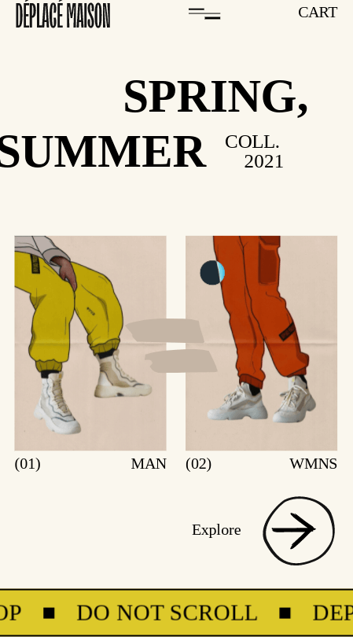
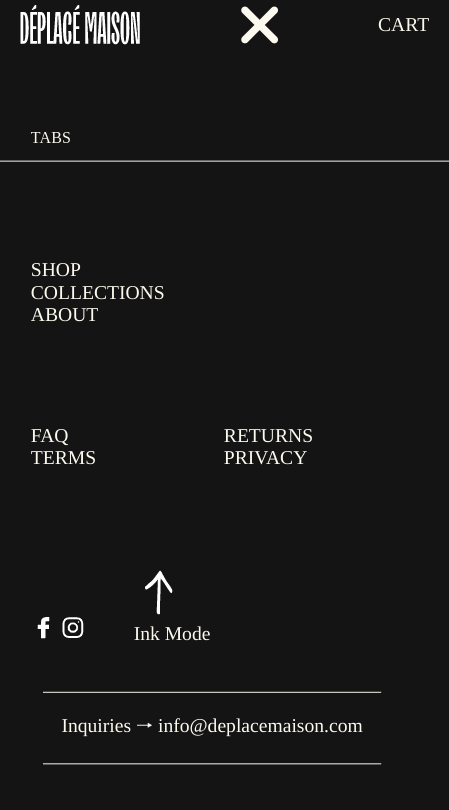

<h1 align="center">Deplace Maison</h1>

   Solution for a challenge from  <a href="https://frontendpractice.com" target="_blank">Frontendpractice.com</a>.

  <h3>
    <a href="https://jdegand.github.io/deplace-maison">
      Github Pages
    </a>
     | 
    <a href="https://www.frontendpractice.com/projects/deplace-maison">
      Frontend Practice
    </a>
  </h3>

## Table of Contents

- [Overview](#overview)
  - [Built With](#built-with)
- [Features](#features)
- [Improvements](#improvements)
- [Useful Resources](#useful-resources)

## Overview

### Built With

- Semantic HTML5 Markup
- CSS custom properties
- Grid
- Flex
- Mobile-First Design

## Features

The [challenge](https://www.frontendpractice.com/project/deplace-maison) was to build an application to complete the following user stories:

- [x] User story: Recreate the layout
- [x] User story: Create the animated gooey cursor and have it blend with other colors.
- [x] User story: Try build the alternating testimonials at the bottom of the page.

## Improvements

- Need to work on animations
- Using a picture element in a card of the slider creates many problems

## Useful Resources

- [Deplace Maison](https://www.deplacemaison.com/#)
- [Image Color Picker](https://imagecolorpicker.com/)
- [Unicode Table](https://www.unicodetable.com)
- [YouTube](https://www.youtube.com/watch?v=KHGc7eZyxKY) - Draggable Slider Tutorial
- [YouTube](https://www.youtube.com/watch?v=5iqdUk4R_2g) - Draggable Slider Tutorial
- [YouTube](https://www.youtube.com/watch?v=IEbaqI7F8vM) - Draggable Slider Tutorial
- [YouTube](https://www.youtube.com/watch?v=LPBGK1gqXoU) - Slider Tutorial Updated
- [Codepen](https://codepen.io/lokesh/pen/YzzKzva) - Gooey Cursor
- [Codepen](https://codepen.io/kellyex/pen/KKwwdYg) - Js draggable slider
- [Github](https://github.com/florentmolle/draggable-touch-slider/blob/main/slider%20draggable/script.js) - Slider Tutorial Touch implementation
- [CSS Script](https://www.cssscript.com/basic-draggable-slider/) - Basic Draggable Slider
- [W3 Schools](https://www.w3schools.com/howto/howto_js_scroll_to_top.asp) - Scroll to top
- [UX Planet](https://uxplanet.org/using-loading-animation-on-websites-and-apps-examples-and-snippets-to-use-cab0097be9f1) - Loading animations
- [Stack Overflow](https://stackoverflow.com/questions/28648019/changing-text-after-regular-interval) - Change text on interval
- [Stack Overflow](https://stackoverflow.com/questions/46182318/setinterval-to-add-class-then-remove-class-for-same-amount-of-time#:~:text=All%20you%20need%20to%20do,clearTimeout()%20or%20clearInterval()%20.) - setInterval & classList toggle
- [CSS Tricks](https://css-tricks.com/multi-line-padded-text/) - Multi-line padded text
